# FiadoPay-POO - Refatoração de API com base em engenharia 

Para assegurar as melhores práticas de desenvolvimento, fizemos uma refatoração do projeto fiadopay, que é um sistema 
financeiro baseado em controle de transações e reembolsos. 

## Design Patterns Aplicados

* **Strategy** - Utilizado para desacoplar a lógica específica de cada método de pagamento (`PixStrategy`, `CreditCardStrategy`, `DebitCardStrategy`, `BoletoStrategy`). O `PaymentService` delega o processamento para a implementação correta, que é selecionada dinamicamente via Reflexão.
* **Chain of Responsibility** - Implementado para o fluxo de Antifraud. As regras de validação são encadeadas, permitindo adicionar ou remover verificações de forma modular.
* **Observer** - Implementado para a funcinalidade de Webhook Sink. O `PaymentService` (Subject) notifica os listeners (classes anotadas com `@WebhookSink`) de forma assíncrona quando um pagamento é concluído.
* **State** - Utilizado para intercambiar entre estados de pagamento (`Pending`, `Approved`, `Cancelled`, `Reproved`, `Refunded`). Cada estado possui comportamento próprio, permitindo transições limpas e coesas.


## Anotações Customizadas e metadados

* **@PaymentMethod** - Garante que o método de pagamento informado no JSON seja mapeado para um processador suportado pelo sistema (ex: "PIX", "BOLETO", "CREDITO", "DEBITO") antes que a lógica de processamento do pagamento seja executada.
* **@AntiFraud** - Anotação de validação automática em nível de classe. Ela verifica se o valor da transação (amount) ultrapassa um limite máximo permitido (R$ 5.000,00). Quando acionada pelo Spring, o AntiFraudValidator lê o valor e, caso exceda o limite, bloqueia a requisição retornando erro, garantindo que transações arriscadas sejam filtradas logo na entrada.
* **@WebhookSink** - Mantém a comunicação e ligação entre as operações de  requests e as response, geradas após o processamento. Quando uma request é concluída com sucesso por exemplo, a criação de um pagamento, confirmação, cancelamento ou atualização a aplicação dispara automaticamente uma resposta em JSON para um endpoint previamente configurado.
* **@CurrencyType** - Garante que apenas moedas suportadas (ex.: “BRL”) sejam aceitas na entrada da requisição.

Anotações próprias do springboot, como @Component, @Service, @Repository foram utilizadas a fim de injeção de dependências, 
garantindo o funcionamento íntegro da aplicação. 

## Mecanismo de Reflexão 
O sistema utiliza os recursos de reflexão do Java, manipulado pelo Spring Framework, para promover desacoplamento e extensibilidade. Através da Injeção de Dependência, o sistema descobre e carrega automaticamente no contexto da aplicação as implementações de `PaymentStrategy`, permitindo que o serviço delegue o processamento sem conhecer as classes concretas. Além disso, o validador customizado `@AntiFraud` utiliza reflexão em tempo de execução para inspecionar a integridade da classe `PaymentRequest`, aplicando regras de negócio dinâmicas antes mesmo da execução do serviço.

## Threads
O sistema usa um ExecutorService com um pool fixo de 4 threads para processar pagamentos e enviar webhooks de forma totalmente assíncrona.
Cada pagamento dispara uma tarefa de processamento em background.
Após o processamento, uma nova tarefa é disparada para enviar o webhook ao merchant.
A entrega do webhook possui até 5 tentativas automáticas, com tempo crescente entre elas (backoff).
Todas essas tarefas são enfileiradas e executadas pelas mesmas 4 threads, garantindo paralelismo controlado, estabilidade e não bloqueio da API principal.

## Limites Conhecidos 
1) **CurrencyTypeValidator**
  * Aceita apenas moedas consideradas válidas pelo sistema ("BRL", "USD")
  * Qualquer moeda fora dessa lista é rejeitada antes do processamento.
2) **PaymentMethodValidator**
  * Só permite métodos de pagamento previamente cadastrados como válidos (ex.: "PIX", "BOLETO", "CREDITO", "DEBITO")
  * Métodos inexistentes ou não suportados são bloqueados imediatamente.
3) **AntiFraudValidator**
  * Impõe um limite máximo para transações (R$ 5.000,00)
  * Se o valor do `amout` ultrapassar esse limite, a requisição é rejeitada.

## Como Utilizar

Clone o repositório:

```bash
git clone https://github.com/mafenandaup/FiadoPay-POO.git
```

Mude o diretório para a pasta principal do projeto

```bash
cd api-fiadopay
```

```bash
./mvnw spring-boot:run
# ou
mvn spring-boot:run
```

Acione o seguinte comando no terminal da IDE:
```bash
./mvnw spring-boot:run
# ou
mvn spring-boot:run
```

H2 console: http://localhost:8080/h2  
Swagger UI: http://localhost:8080/swagger-ui.html

## Teste 1: Cadastro de merchant:

1) **Entrada válida**
```bash
curl -X POST http://localhost:8080/fiadopay/admin/merchants   -H "Content-Type: application/json"   -d '{"name":"MinhaLoja ADS","webhookUrl":"http://localhost:8081/webhooks/payments"}'
```

2) **Saída esperada**
```bash
{"id":1,
"name":"MinhaLoja ADS",
"clientId":"aaab326b-bc9a-4516-bd00-72ced29028a7",
"clientSecret":"4f0151b872af4670a5f38641fa917df5",
"webhookUrl":"http://localhost:8081/webhooks/payments",
"status":"ACTIVE"}
```
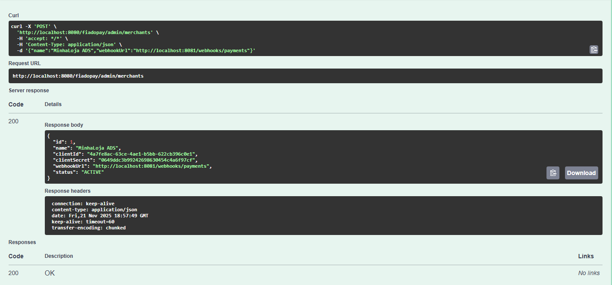

**IMPORTANTE**: a cada geração de merchant, serão retornados ID e Chave secret diferentes. Então se tentar usar as mesmas saídas do exemplo anterior em um teste real, elas não serão validadas ao obter o token de autenticação.

Caso tente inserir uma string de nome vazia:

```bash
{"name":"must not be blank"}
```
```bash
{"webhookUrl":"must not be blank"}
```
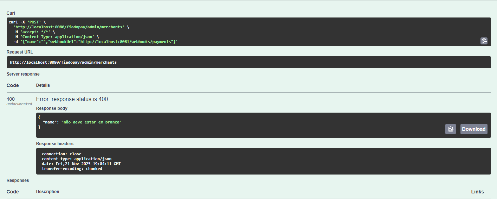
Em caso de nome e webhook iguais a um existente:
```bash
{"webhookUrl":"must not be blank"}
```
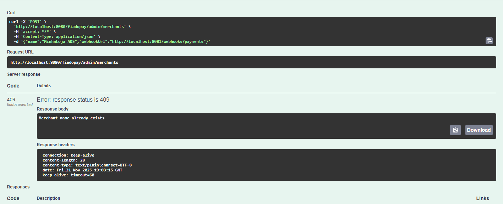


## Teste 2: Obtendo o Token de Autenticação do merchant:

1) **Entrada válida**

```bash
curl -X POST http://localhost:8080/fiadopay/auth/token   -H "Content-Type: application/json"   -d '{"client_id":"<clientId>","client_secret":"<clientSecret>"}'
```

para este exemplo em específico, a entrada seria:
```bash
curl -X POST http://localhost:8080/fiadopay/auth/token   -H "Content-Type: application/json"   -d '{"client_id":"aaab326b-bc9a-4516-bd00-72ced29028a7","client_secret":"4f0151b872af4670a5f38641fa917df5"}'
```

2) **Saída esperada**

```bash
{"access_token":"FAKE-1","token_type":"Bearer","expires_in":3600}
```
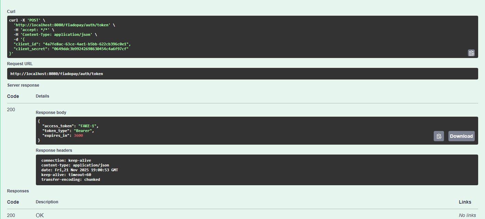
Caso tente inserir qualquer um dos campos como uma string vazia, aparecerá o seguinte erro:

```bash
{"client_secret":"must not be blank"}
```
```bash
{"id":"must not be blank"}
```
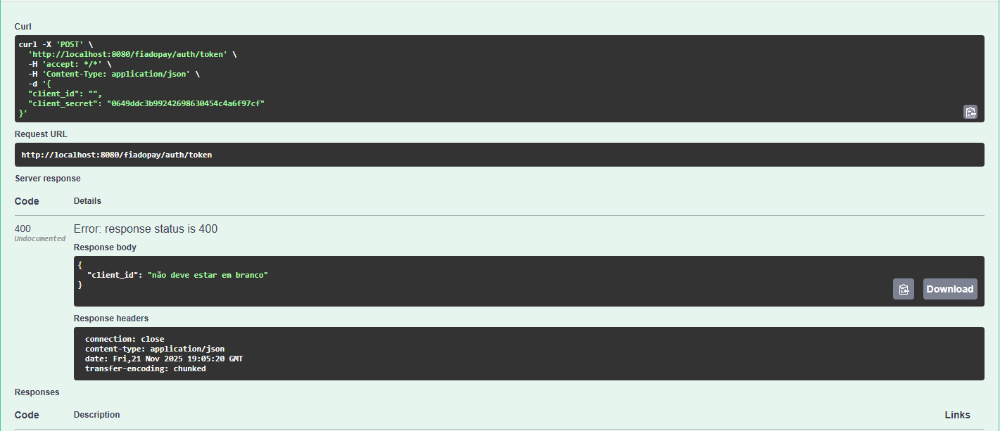

## Teste 3: Criação/validação do pagamento:

1) **Entrada válida**
```bash
 curl -X POST http://localhost:8080/fiadopay/gateway/payments   -H "Authorization: Bearer FAKE-1"   -H "Idempotency-Key: 550e8400-e29b-41d4-a716-446655440000"   -H "Content-Type: application/json"   -d '{"method":"CREDITO","currency":"USD","amount":4999,"installments":12,"metadataOrderId":"ORD-123"}'
```
2) **Saída esperada**

```bash
{"id":"pay_5468f9b6","status":"PENDING","method":"CREDITO","amount":4999,"installments":12,"interestRate":null,"total":4999,"errorMsg":null}
```
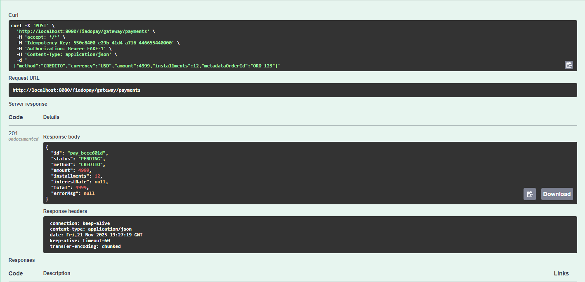
Ao tentar inserir method/currency com uma string vazia OU amount como uma quantia nula:
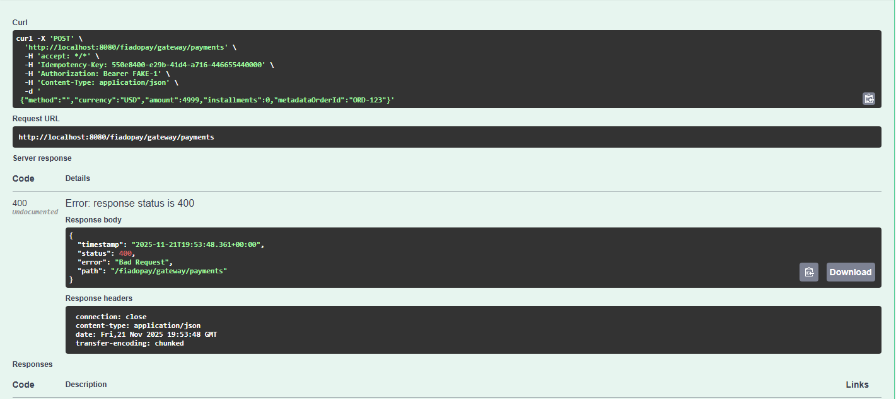
```bash
{"timestamp":"2025-11-21T15:08:56.217+00:00","status":400,"error":"Bad Request"}
```

Ao inserir um método com uma string diferente das permitidas (PIX, CARTAO, DEBITO, CREDITO) - as strings são validadas com IgnoreCase, então caracteres maiúsculos e minísculos não se diferenciam, mas caracteres especiais (como números e acentos) sim.

exemplo de campo inválido:

```bash
"method":"PIXIIII"
```
saída esperada:
```bash
{"method":"Método de pagamento inválido. Permitidos: PIX, BOLETO, CREDITO, DEBITO."}
```
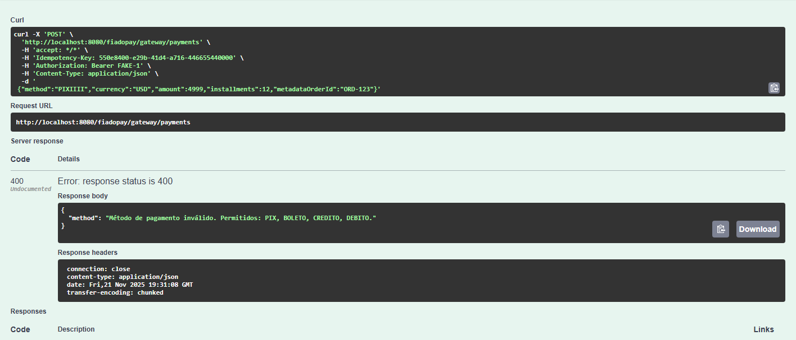
Ao inserir uma moeda (currency) diferente do formato estipulado pela biblioteca java.Currency (3 letras, case Sensitive - nesse caso, maíusculas e minúsculas são diferenciados)

exemplo de campo inválido:

```bash
"currency":"brlll"
```

saída esperada:
```bash
{"currency":"Tipo de moeda inválido: 'brll'.Tente novamente."}
```
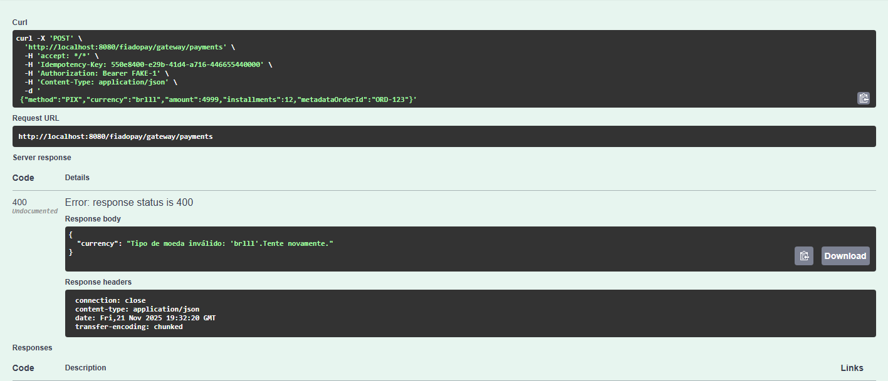
Ao estipular uma quantia maior que o limite de 5000.0 proposto no AntiFraudValidator:


exemplo de campo inválido:

```bash
"amount":"5999.0"
```
saída esperada:
```bash
{"amount":"Valor acima do limite anti fraude: R$ 5000.0. Tente novamente."}
```


Ao inserir número de installments menor que 1 e maior que 12:

```bash
 {"installments":"must be less than or equal to 12"}
```
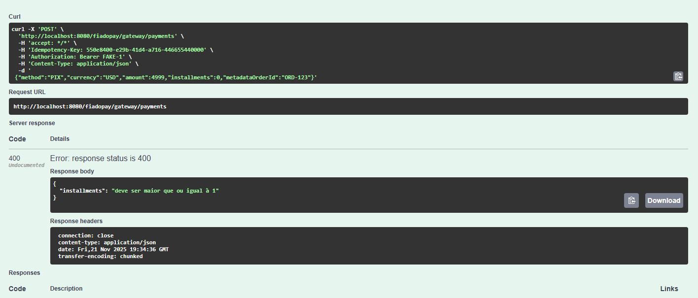
## Teste 4: Criação/validação do pagamento:

1) **Entrada válida**

```bash
curl http://localhost:8080/fiadopay/gateway/payments/<paymentId>
```

para esse exemplo em específico:
```bash
curl http://localhost:8080/fiadopay/gateway/payments/pay_5468f9b7
```


2) **Saída esperada**

```bash
{"id":"pay_5468f9b6","status":"APPROVED","method":"CREDITO","amount":4999.00,"installments":12,"interestRate":null,"total":4999.00,"errorMsg":null}
```
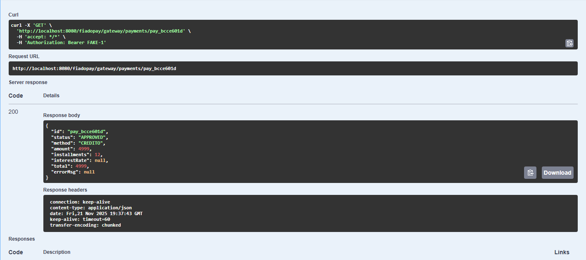
String nula no campo paymentId:

```bash
{"timestamp":"2025-11-21T15:28:51.823+00:00","status":404,"error":"Not Found","path":"/fiadopay/gateway/payments/"}
```
## Teste 5: Solicitação de Reembolso 

1) **Entrada válida**
```bash
curl -X POST \
  'http://localhost:8080/fiadopay/gateway/refunds' \
  -H 'accept: */*' \
  -H 'Authorization: Bearer FAKE-1' \
  -H 'Content-Type: application/json' \
  -d '{
    "paymentId": "pay_39d67e2b"
  }'
```

2) Saída esperada 

```bash
{
  "id": "ref_0dadd0a1-04d8-441a-b181-78a403d5d3a9",
  "status": "PENDING"
}
```
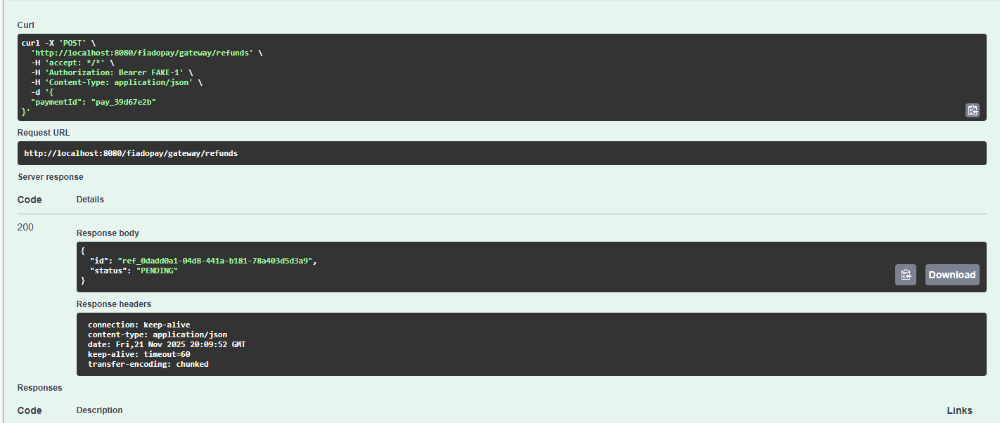
Entrada inválida (paymentId vazio)


```bash
curl -X POST \
  'http://localhost:8080/fiadopay/gateway/refunds' \
  -H 'accept: */*' \
  -H 'Content-Type: application/json' \
  -d '{
    "paymentId": ""
  }'


```
Saída esperada (400 - Erro)

```bash
{
  "paymentId": "não deve estar em branco"
}

```
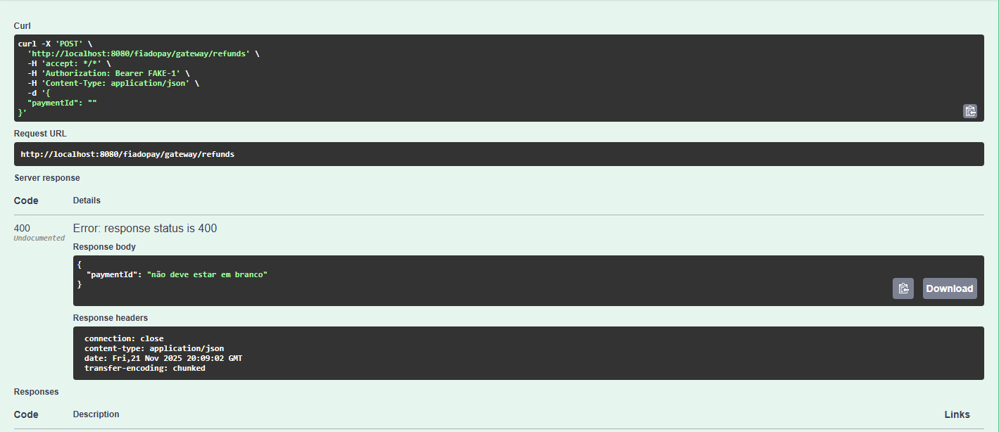
## Fluxo

1) **Cadastrar merchant**
```bash
curl -X POST http://localhost:8080/fiadopay/admin/merchants   -H "Content-Type: application/json"   -d '{"name":"MinhaLoja ADS","webhookUrl":"http://localhost:8081/webhooks/payments"}'
```

2) **Obter token**
```bash
curl -X POST http://localhost:8080/fiadopay/auth/token   -H "Content-Type: application/json"   -d '{"client_id":"<clientId>","client_secret":"<clientSecret>"}'
```

3) **Criar pagamento**
```bash
curl -X POST http://localhost:8080/fiadopay/gateway/payments   -H "Authorization: Bearer FAKE-<merchantId>"   -H "Idempotency-Key: 550e8400-e29b-41d4-a716-446655440000"   -H "Content-Type: application/json"   -d '{"method":"CARD","currency":"BRL","amount":250.50,"installments":12,"metadataOrderId":"ORD-123"}'
```

4) **Consultar pagamento**
```bash
curl http://localhost:8080/fiadopay/gateway/payments/<paymentId>
```
